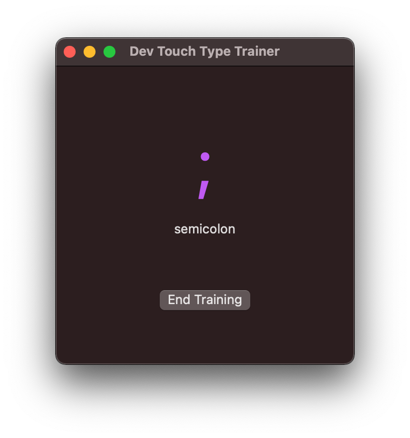

# Developer Touch Type Trainer
A prototype for a dev touch type trainer made with SwiftUI for macOS.

Train special characters like `[`, `{`, `;`, ... and numbers.

[Link to tweet with video](https://twitter.com/denisenepraunig/status/1385704843298357254?s=20).

